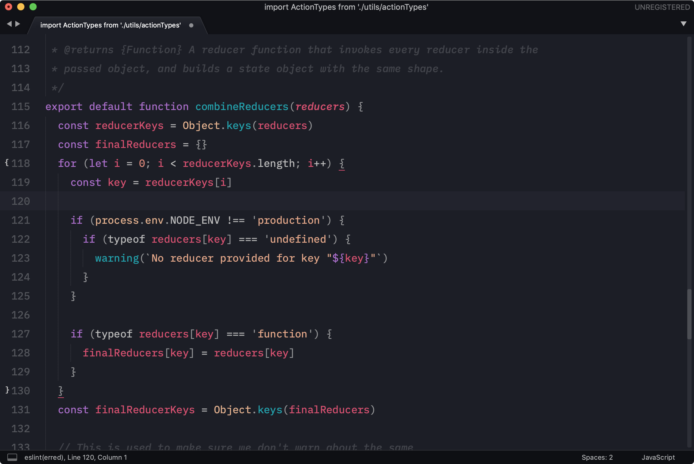

# Horizon Color Scheme for Sublime Text

Based on [Horizon for Visual Studio Code](https://github.com/jolaleye/horizon-theme-vscode)

## Installation

### Package Control

The easiest way to install is using [Package Control](https://packagecontrol.io/)

1. Open Command Palette using menu item `Tools -> Command Palette...` (<kbd>⇧</kbd><kbd>⌘</kbd><kbd>P</kbd> on Mac) (<kbd>ctrl</kbd><kbd>shift</kbd><kbd>P</kbd> on Windows)
2. Choose `Package Control: Install Package`
3. Find `Color Scheme - Horizon` and hit <kbd>Enter</kbd>

### Manual

You can also install the theme manually:

1. [Download the .zip](https://github.com/Briles/horizon-sublime/archive/master.zip)
2. Extract the contents of the .zip to your Sublime Text `Packages` directory, which you can find using the menu item `Sublime Text -> Preferences -> Browse Packages...`

---

## License

[MIT](https://en.wikipedia.org/wiki/MIT_License)
